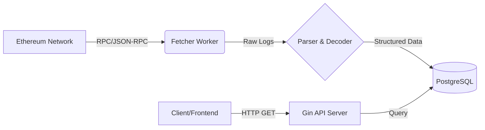

# 🚀 EVM High-Performance Indexer (Go + Solidity)


A production-ready blockchain event indexer built with **Go** and **PostgreSQL**.
Designed to monitor real-time EVM smart contract events (e.g., USDT Transfers), persist data with idempotency, and serve analytics via a high-performance RESTful API.

> **Why this project?**
> This project demonstrates the transition from traditional backend architecture to Web3 infrastructure, solving key challenges like **RPC rate limiting**, **data persistence**, and **fault tolerance** in blockchain synchronization.

## 🌟 Key Features

* **Real-time Event Tracking**: Automatically polls and indexes ERC-20 `Transfer` events from the Ethereum Mainnet.
* **Fault Tolerance & Resume**: Built-in checkpoint mechanism. Automatically resumes from the last synced block after a restart.
* **Idempotency Design**: Uses `ON CONFLICT DO NOTHING` strategies to ensure data consistency and prevent duplicate records during re-processing.
* **Batch Processing**: Optimized chunk-based fetching (10 blocks/batch) to handle RPC limits gracefully.
* **Containerized**: Full Docker & Docker Compose support for one-click deployment.
* **CI/CD Ready**: Configured for automated testing pipelines.

## 🛠 Tech Stack

* **Language**: Golang 1.21+
* **Blockchain SDK**: [go-ethereum (geth)](https://github.com/ethereum/go-ethereum) - Native bindings.
* **Database**: PostgreSQL 15 (Storage), GORM (ORM).
* **Web Framework**: Gin Gonic (REST API).
* **Infrastructure**: Docker, Docker Compose, GitHub Actions.

## 🏗 Architecture

The system follows a layered ETL (Extract, Transform, Load) architecture:



## 🚀 Quick Start

### Prerequisites
* [Docker](https://www.docker.com/) & Docker Compose installed.
* An Ethereum RPC Endpoint (Get a free key from [Infura](https://infura.io/) or [Alchemy](https://www.alchemy.com/)).

### 1. Clone the Repository
```bash
git clone https://github.com/[YOUR_USERNAME]/evm-indexer.git
cd evm-indexer
```

### 2. Configure Environment
Create a `.env` file in the root directory (do NOT commit this file). You can copy the example:

```bash
# Create .env file
echo "RPC_URL=https://mainnet.infura.io/v3/YOUR_API_KEY_HERE" > .env
```
*Note: The database credentials are configured in `docker-compose.yml` for simplicity in this demo.*

### 3. Run with Docker Compose
Start the Postgres database and the Indexer service with one command:

```bash
docker-compose up --build -d
```

Check the logs to see the syncing process:
```bash
docker-compose logs -f app
```
*Expected Output:*
> `>>> Syncing: Block 18000000 -> 18000010 (Lag: 50 blocks)`
> `   -> Successfully indexed 15 transactions`

### 4. Access the API
The API server runs on port `8080`.

**Query Transfer Logs:**
```http
GET http://localhost:8080/api/v1/transfers?address=0xdAC17F958D2ee523a2206206994597C13D831ec7
```

**Response Example:**
```json
{
  "data": [
    {
      "TxHash": "0x706142e2...",
      "BlockNumber": 18000011,
      "FromAddress": "0x4E5B...",
      "ToAddress": "0xd653...",
      "Amount": "435363000"
    }
  ],
  "total": 1
}
```

## 📂 Project Structure

```text
.
├── .github/workflows   # CI/CD Pipeline configuration
├── token/              # Generated Go bindings (ABIGen) for Smart Contracts
├── Dockerfile          # Multi-stage Docker build
├── docker-compose.yml  # Container orchestration
├── main.go             # Entry point & Indexer Logic (Daemon)
├── server.go           # REST API Server implementation
├── go.mod              # Dependencies
└── README.md           # Documentation
```

## 🛣 Roadmap

* [x] Basic Event Indexing (ERC20)
* [x] Dockerization & CI/CD
* [ ] **Chain Reorg Handling**: Implement block hash verification to detect and rollback reorged blocks.
* [ ] **WebSocket Support**: Push real-time events to frontend clients.
* [ ] **Multi-Chain Support**: Abstract the config to support BSC, Polygon, and Arbitrum.

## 👨‍💻 Author

**GuangchaoYi**
* Full Stack Developer (Go / Java / Solidity)
* [https://github.com/yiguangchao]